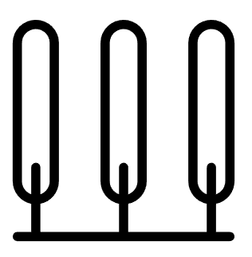

<h1 align="center">AlayaCare Cypress - QA Automation Challenge 🚀</h1>

<div align="center">
  <a href="https://github.com/AlayaCare/cypress-interview-handbook">
    
  </a>
  <h3>Welcome!</h3>
  <br>
</div>

<hr/>

## What is this?
A set of take home questions used to assess your technical skills with Cypress. After cloning and setting yourself up, you
will have a small scale web application against which you will write test assertions. Step by step instructions will introduce
you to common situations we are currently facing at work.  

#### ⚠️ Important 
No stress! Submit answers that YOU think are the most relevant, there is NO right or wrong answers.

## What's next?
Follow these steps to get a local version of this project running locally:
```bash
# Clone the project in /cypress-interview-handbook
git clone https://github.com/AlayaCare/cypress-interview-handbook

# Install dependencies
cd cypress-interview-handbook
npm i

# Start the webapp
npm run start

# In another terminal, to start Cypress
npm run cy:open

# Specific to the second problem:
npm run start:problem-2
```